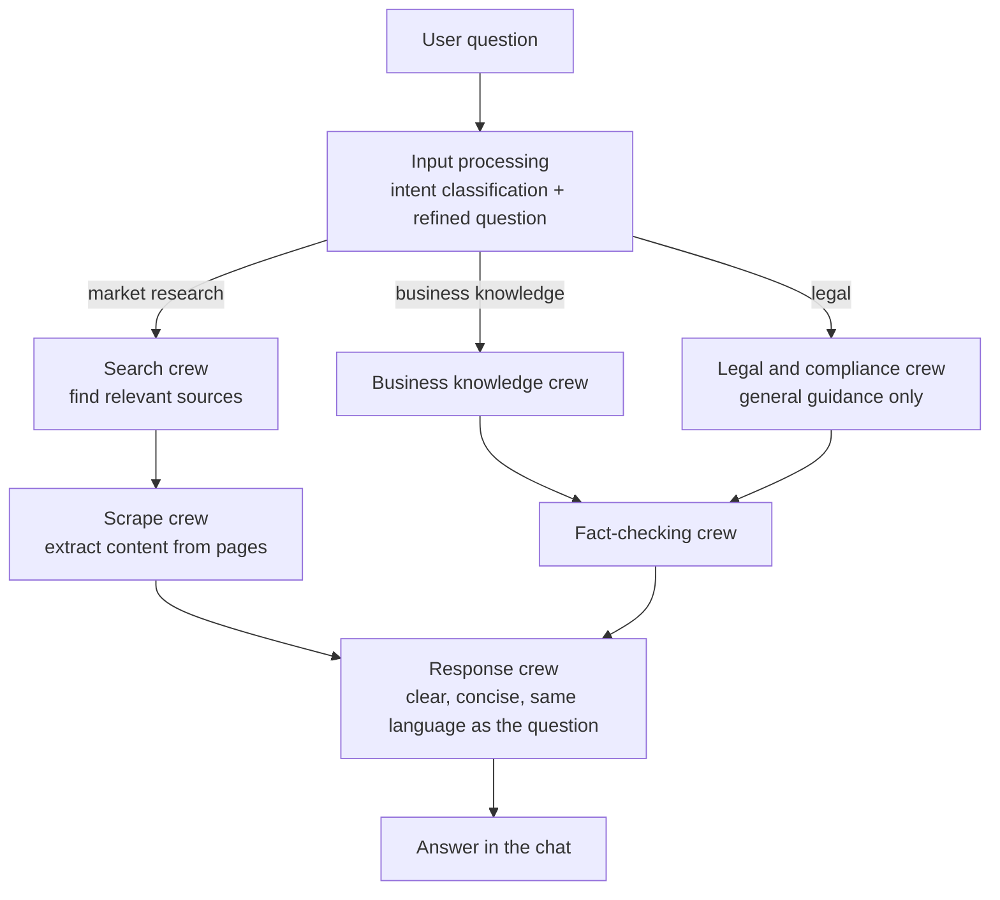

# Business Buddy (business_chatbot)

A multi-agent chatbot that answers business questions for solo founders and small businesses who can't afford a consultant. It was my Maturita (school-leaving exam) project and received the top grade (1 on the Slovak scale). The written thesis and the presentation, in Slovak, are in this repository (`__MS__/` and `_Prezentacia_/`).

> **Scope:** an educational project. It has had no outside users and is no longer maintained. Its answers are general information, not legal, financial or business advice.

## What it does

A user asks a business question in a chat window. A Python service built on [CrewAI](https://www.crewai.com) decides what kind of question it is and sends it to the right group of agents, checks the draft answer, and rewrites it into a clear reply in the user's own language.



## Agents

| Crew | Role |
|---|---|
| Input processing | Classifies the question as market research, business knowledge or legal, and returns a refined question with a confidence score |
| Search and scrape | Find and extract up-to-date information for market-research questions |
| Business knowledge | Answers questions on strategy, marketing, finance and operations |
| Legal and compliance | Gives general legal and compliance guidance for startups (not legal advice) |
| Fact-checking | Validates draft answers against credible sources |
| Response | Formats the final answer in plain language |

## Architecture

- **Web app:** Ruby on Rails (users, chats, messages).
- **AI service:** Python, FastAPI and a CrewAI Flow (`python_api/bot_flow`) that routes between the crews.
- **Models:** configurable; the code maps names to OpenAI, Anthropic (Claude) or DeepSeek models, and each needs its own API key.

## Running it

The original Slovak setup guide (installing Ruby, Rails and Python on Linux, plus Docker deployment) is in [docs/INSTALL.sk.md](docs/INSTALL.sk.md).

In development the project starts three processes, defined in `Procfile.dev`:

```bash
bin/rails server                          # web app, http://localhost:3000
bin/rails tailwindcss:watch               # stylesheet build
python ./python_api/server.py             # AI service, http://localhost:8000
```

It needs PostgreSQL (see `.env.example`) and your own API keys for the model providers. These steps come from the project files; I have not re-run them since 2025.

## Author

Matus Labaj, 2025.
